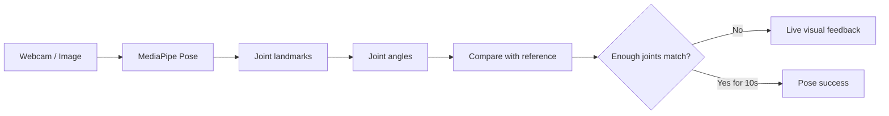
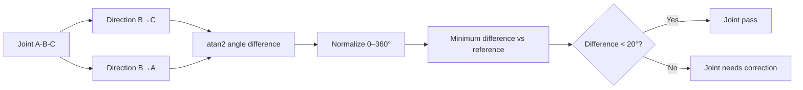

<div align="center">

# 🧘 RealTimeYoga

### Real-time pose feedback with MediaPipe.

웹캠이나 이미지에서 사람의 자세를 읽고 **관절 각도 차이로 기준 요가 자세와 비교**하는 computer-vision experiment입니다.

<p>
  
  
  
  
</p>

### [▶ Browser Demo](https://rudwpahs.github.io/RealTimeYoga/)

[How it works](#how-it-works) · [Algorithm](#angle-matching) · [Run](#run) · [Limits](#scope--limits)

</div>

---

## How it works



현재 판정 흐름은 다음과 같습니다.

1. 웹캠 프레임 또는 입력 이미지를 읽습니다.
2. MediaPipe Pose로 관절 landmark를 찾습니다.
3. 세 관절 좌표로 각도를 계산합니다.
4. 기준 각도와 현재 각도의 차이를 구합니다.
5. 차이가 `20°`보다 작으면 해당 관절을 성공으로 봅니다.
6. 기준을 만족하는 관절이 **10개를 넘는 상태가 10초 이상 유지**되면 자세 성공으로 처리합니다.

## Angle matching

세 관절 `A-B-C`에서 B를 중심으로 두 방향을 비교합니다.



화면에서는 맞는 관절은 파란색, 기준에서 많이 벗어난 관절은 빨간색으로 표시합니다.

## Run

Requirements:

- Python 3.9+
- Webcam or test image

```bash
pip install -r requirements.txt
python main.py
```

웹캠 없이 이미지로 확인하려면:

```bash
python main.py --image easy.png
```

웹캠이 없으면 기본 demo image로 자동 전환하는 경로도 들어 있습니다.

## Deployment forms

| Target | Available form |
|---|---|
| Python | Original app |
| Windows | Package / installer |
| Browser | GitHub Pages demo |

## Stack

`Python` · `OpenCV` · `MediaPipe Pose` · `NumPy` · joint-angle rule matching

## Scope & limits

> 이 프로젝트는 **MediaPipe 기반 자세 인식 실험**입니다.

결과는 운동 자세를 도와주는 피드백이며 의료 진단, 재활 판단, 전문적인 생체역학 측정으로 사용하지 않습니다.
